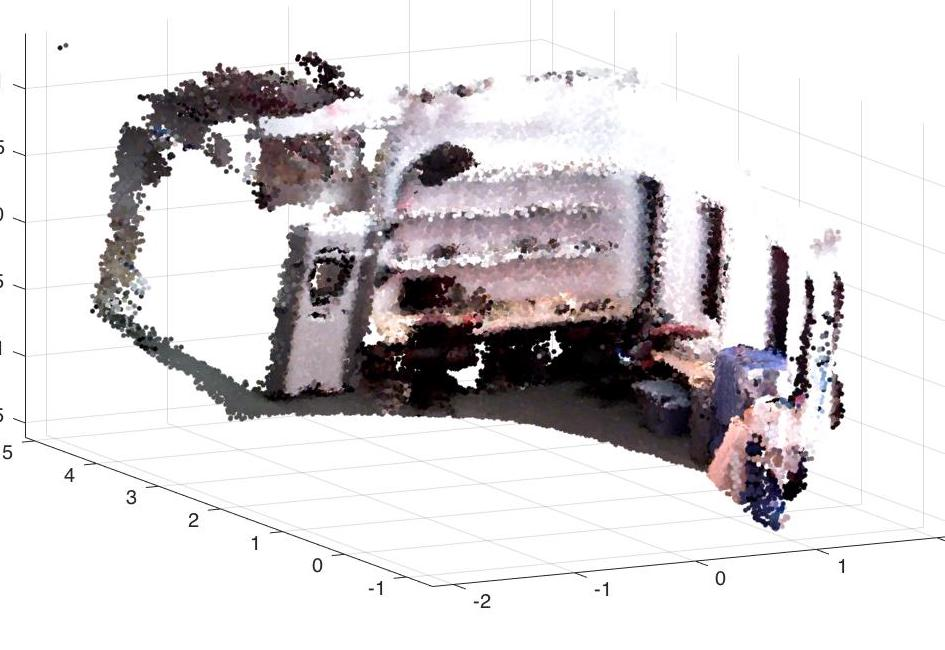

## 3D Reconstruction based on Iterative Closest Point (ICP) 

UPenn ESE 650 Learning in Robotics, Final Project. Implemented efficient Iterative Closest Point (ICP) method for 3d reconstruction from RGBD dataset.

- Detailed project report: [report/ESE650final_proj_report_Yiren_Lu.pdf](report/ESE650final_proj_report_Yiren_Lu.pdf)
- Presentation slides: [report/ESE650final_project_slides.pdf](report/ESE650final_project_slides.pdf)

#### Code

- Run `demo.m`
- To re-execute the data preprocess pipeline, please place the `./depth`, `./rgb` and `vicon.mat` of dataset 5 into the `./5` folder and run `data_preprocess.m`
- The main ICP implementation is in `submission/icp_all.m` and some functions under "./utils".

